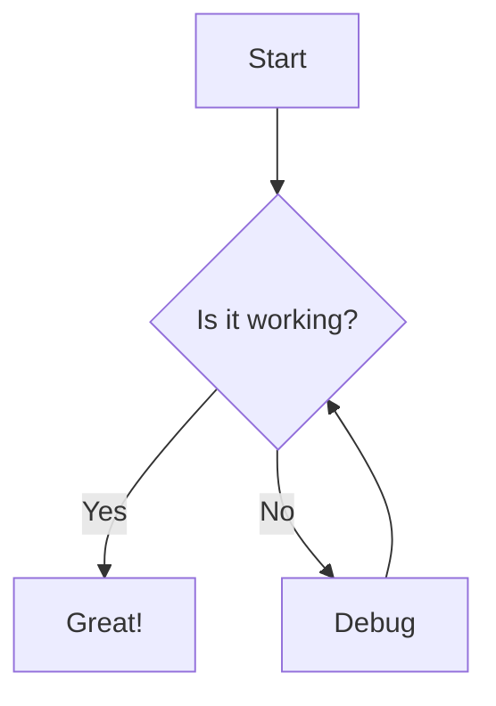

# Markdown to PDF Converter (Node.js/PNG Approach)

This approach uses a custom Node.js script to convert Markdown files with Mermaid diagrams into PDF documents. It works by converting Mermaid diagrams to PNG images before incorporating them into the final PDF.

## Features

- Converts Markdown files to PDF while preserving Mermaid diagrams
- Automatically processes multiple Mermaid diagrams in a single document
- Supports custom output filenames
- Provides detailed progress feedback
- Cleans up temporary files automatically
- Handles errors gracefully

## Prerequisites

Before using this tool, make sure you have the following installed:

1. **Node.js and npm** - [Download from nodejs.org](https://nodejs.org/)
2. **Mermaid CLI** - For converting Mermaid diagrams to images
   ```bash
   npm install -g @mermaid-js/mermaid-cli
   ```
3. **Pandoc** - For converting Markdown to PDF
4. **LaTeX** - Required by Pandoc for PDF generation

For detailed installation instructions for each dependency, see the root README.md.

## Usage

The script can be used in two ways:

1. **Basic usage** - Output PDF will have the same name as input file:
   ```bash
   node mermaid-to-pdf.js input.md
   ```

2. **Specify output filename** - Choose your own output filename:
   ```bash
   node mermaid-to-pdf.js input.md custom-output.pdf
   ```

### Example Markdown File

````markdown
# My Document

Here's a flowchart:


````

## Technical Details

The script performs the following steps:

1. Reads the input Markdown file
2. Creates a temporary directory for image files
3. Identifies Mermaid diagram code blocks
4. Converts each Mermaid diagram to a PNG image
5. Replaces Mermaid code blocks with image references
6. Uses Pandoc to convert the processed Markdown to PDF
7. Cleans up temporary files

## Pros and Cons

### Advantages
- Fine-grained control over the conversion process
- Detailed progress feedback
- Flexible output naming
- Automatic cleanup of temporary files
- Comprehensive error handling

### Disadvantages
- More complex implementation
- Requires maintaining custom Node.js script
- PNG images may not scale as well as vector formats
- Multiple conversion steps may affect quality 